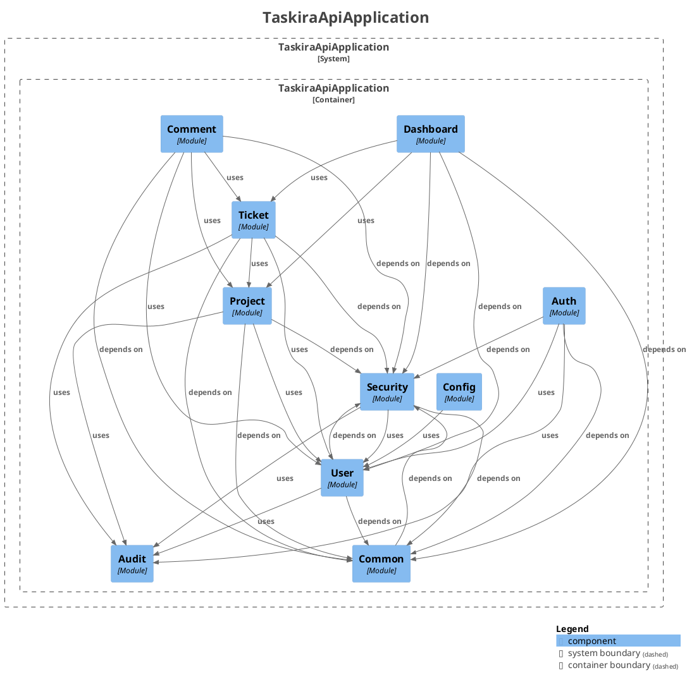

# Frontières de modules (Spring Modulith)

Statut : vérifié mécaniquement depuis la phase 5. Voir [ADR-0016](adr/0016-spring-modulith-boundaries.md).

## Graphe de dépendances vérifié

Régénéré le 16 août 2026 par `ModularityTests.writesModuleDocumentation` (`backend/target/spring-modulith-docs/components.puml`, non versionné — régénérer avec la commande ci-dessous) pour refléter le nouveau module `audit` (phase 9).



Point notable : `Ticket -> Project` existe, `Project -> Ticket` n'existe pas. Un cycle réel a été détecté et corrigé pendant la phase 5 (voir ci-dessous) avant d'atteindre cet état. Nouveau en phase 9 : `Audit` n'a aucune arête sortante vers un module métier (seulement vers `common`/`security`, `OPEN`) — c'est un puits pur, cinq modules en dépendent (`security`, `auth`, `ticket`, `project`, `user`) et aucun cycle n'apparaît.

## Modules ouverts (socle transversal)

`common`, `config` et `security` sont déclarés `@ApplicationModule(type = OPEN)` : accessibles depuis n'importe quel module, comme documenté dans ADR-0016.

## Interfaces nommées exposées par les modules métier

| Module propriétaire | Sous-package exposé | Consommé par |
| --- | --- | --- |
| `project` | `entity`, `repository`, `enums` | `ticket`, `comment` |
| `project` | `service.ProjectMemberAssignmentCheck` (type) | `ticket` (implémentation, voir ci-dessous) |
| `ticket` | `entity`, `repository`, `enums`, `dto` | `comment`, `dashboard` |
| `ticket` | `service.TicketHistoryService` (type) | `comment` |
| `ticket` | `specification` | `dashboard` |
| `user` | `entity`, `repository`, `enums`, `dto` | `auth`, `project`, `ticket`, `comment` |
| `audit` | `service.AuditService` (type) | `auth`, `project`, `ticket`, `user` |
| `audit` | `enums` | `auth`, `project`, `ticket`, `user` |

`comment`, `dashboard` et `auth` ne sont consommés par personne et restent entièrement fermés (aucun autre module n'importe leurs types). `audit` (P9) est lui-même fermé par défaut — seul `AuditService` et ses enums sont exposés — et ne dépend d'aucun module métier en retour (uniquement `common`/`security`, tous deux `OPEN`), donc aucun cycle : c'est un puits, jamais une source.

## Cycle détecté et corrigé pendant la phase 5

`ProjectService.removeMember()` appelait directement `TicketRepository.countByProjectIdAndAssigneeId(...)` pour appliquer la règle « impossible de retirer un membre avec des tickets assignés ». Combiné à la dépendance structurelle `Ticket -> Project` (relation JPA `@ManyToOne`), cela créait un cycle `project -> ticket -> project` que `ModularityTests` a détecté à l'exécution.

Correction appliquée par inversion de dépendance (port/adapter), sans changer le comportement transactionnel :

- `com.joe.taskira.project.service.ProjectMemberAssignmentCheck` : interface (port) définie **dans** `project`, qui en a besoin.
- `com.joe.taskira.ticket.service.ProjectMemberAssignmentCheckAdapter` : implémentation **dans** `ticket`, qui a la donnée.
- `ProjectService` injecte désormais le port au lieu de `TicketRepository` directement.

Résultat : `ticket -> project` reste (direction naturelle, un ticket appartient à un projet), `project -> ticket` disparaît. Spring bâtit le bean `ProjectMemberAssignmentCheckAdapter` normalement; Modulith n'objecte plus puisque le port est nommé et exposé.

## Régénérer cette documentation

```powershell
docker run --rm `
  -v taskira_maven_cache:/root/.m2 `
  -v "${PWD}\backend:/workspace" `
  -w /workspace `
  taskira-backend-build `
  ./mvnw -Dtest=ModularityTests test
```

Sort dans `backend/target/spring-modulith-docs/` (ignoré par Git, comme les rapports JaCoCo/coverage).
