# Frontières de modules (Spring Modulith)

Statut : vérifié mécaniquement depuis la phase 5. Voir [ADR-0016](../adr/0016-spring-modulith-boundaries.md).

## Graphe de dépendances vérifié

Régénéré le 22 août 2026 par `ModularityTests.writesModuleDocumentation` (`backend/target/spring-modulith-docs/components.puml`, non versionné — régénérer avec la commande ci-dessous) pour refléter les treize modules actuels, y compris `notifications` (P12), `attachments` (P13) et `exports` (P14), absents des versions antérieures de ce document.

```plantuml
@startuml
title <size:24>TaskiraApiApplication</size>

set separator none
top to bottom direction

<style>
  root {
    BackgroundColor: #ffffff
    FontColor: #444444
  }
</style>

!include <C4/C4>
!include <C4/C4_Context>
!include <C4/C4_Component>

System_Boundary("TaskiraApiApplication_boundary", "TaskiraApiApplication", $tags="") {
  Container_Boundary("TaskiraApiApplication.TaskiraApiApplication_boundary", "TaskiraApiApplication", $tags="") {
    Component(TaskiraApiApplication.TaskiraApiApplication.Exports, "Exports", $techn="Module", $descr="", $tags="", $link="")
    Component(TaskiraApiApplication.TaskiraApiApplication.Notifications, "Notifications", $techn="Module", $descr="", $tags="", $link="")
    Component(TaskiraApiApplication.TaskiraApiApplication.Project, "Project", $techn="Module", $descr="", $tags="", $link="")
    Component(TaskiraApiApplication.TaskiraApiApplication.Security, "Security", $techn="Module", $descr="", $tags="", $link="")
    Component(TaskiraApiApplication.TaskiraApiApplication.Ticket, "Ticket", $techn="Module", $descr="", $tags="", $link="")
    Component(TaskiraApiApplication.TaskiraApiApplication.User, "User", $techn="Module", $descr="", $tags="", $link="")
    Component(TaskiraApiApplication.TaskiraApiApplication.Attachments, "Attachments", $techn="Module", $descr="", $tags="", $link="")
    Component(TaskiraApiApplication.TaskiraApiApplication.Audit, "Audit", $techn="Module", $descr="", $tags="", $link="")
    Component(TaskiraApiApplication.TaskiraApiApplication.Auth, "Auth", $techn="Module", $descr="", $tags="", $link="")
    Component(TaskiraApiApplication.TaskiraApiApplication.Comment, "Comment", $techn="Module", $descr="", $tags="", $link="")
    Component(TaskiraApiApplication.TaskiraApiApplication.Common, "Common", $techn="Module", $descr="", $tags="", $link="")
    Component(TaskiraApiApplication.TaskiraApiApplication.Config, "Config", $techn="Module", $descr="", $tags="", $link="")
    Component(TaskiraApiApplication.TaskiraApiApplication.Dashboard, "Dashboard", $techn="Module", $descr="", $tags="", $link="")
  }
}

Rel(TaskiraApiApplication.TaskiraApiApplication.Dashboard, TaskiraApiApplication.TaskiraApiApplication.User, "depends on", $techn="", $tags="", $link="")
Rel(TaskiraApiApplication.TaskiraApiApplication.Dashboard, TaskiraApiApplication.TaskiraApiApplication.Security, "depends on", $techn="", $tags="", $link="")
Rel(TaskiraApiApplication.TaskiraApiApplication.Dashboard, TaskiraApiApplication.TaskiraApiApplication.Common, "depends on", $techn="", $tags="", $link="")
Rel(TaskiraApiApplication.TaskiraApiApplication.Dashboard, TaskiraApiApplication.TaskiraApiApplication.Project, "uses", $techn="", $tags="", $link="")
Rel(TaskiraApiApplication.TaskiraApiApplication.Dashboard, TaskiraApiApplication.TaskiraApiApplication.Ticket, "uses", $techn="", $tags="", $link="")
Rel(TaskiraApiApplication.TaskiraApiApplication.Auth, TaskiraApiApplication.TaskiraApiApplication.Security, "depends on", $techn="", $tags="", $link="")
Rel(TaskiraApiApplication.TaskiraApiApplication.Auth, TaskiraApiApplication.TaskiraApiApplication.Common, "depends on", $techn="", $tags="", $link="")
Rel(TaskiraApiApplication.TaskiraApiApplication.Auth, TaskiraApiApplication.TaskiraApiApplication.User, "uses", $techn="", $tags="", $link="")
Rel(TaskiraApiApplication.TaskiraApiApplication.Auth, TaskiraApiApplication.TaskiraApiApplication.Audit, "uses", $techn="", $tags="", $link="")
Rel(TaskiraApiApplication.TaskiraApiApplication.Common, TaskiraApiApplication.TaskiraApiApplication.Security, "depends on", $techn="", $tags="", $link="")
Rel(TaskiraApiApplication.TaskiraApiApplication.Config, TaskiraApiApplication.TaskiraApiApplication.Ticket, "uses", $techn="", $tags="", $link="")
Rel(TaskiraApiApplication.TaskiraApiApplication.Config, TaskiraApiApplication.TaskiraApiApplication.Project, "uses", $techn="", $tags="", $link="")
Rel(TaskiraApiApplication.TaskiraApiApplication.Config, TaskiraApiApplication.TaskiraApiApplication.User, "uses", $techn="", $tags="", $link="")
Rel(TaskiraApiApplication.TaskiraApiApplication.Project, TaskiraApiApplication.TaskiraApiApplication.Common, "depends on", $techn="", $tags="", $link="")
Rel(TaskiraApiApplication.TaskiraApiApplication.Project, TaskiraApiApplication.TaskiraApiApplication.Security, "depends on", $techn="", $tags="", $link="")
Rel(TaskiraApiApplication.TaskiraApiApplication.Project, TaskiraApiApplication.TaskiraApiApplication.User, "uses", $techn="", $tags="", $link="")
Rel(TaskiraApiApplication.TaskiraApiApplication.Project, TaskiraApiApplication.TaskiraApiApplication.Audit, "uses", $techn="", $tags="", $link="")
Rel(TaskiraApiApplication.TaskiraApiApplication.Security, TaskiraApiApplication.TaskiraApiApplication.Common, "depends on", $techn="", $tags="", $link="")
Rel(TaskiraApiApplication.TaskiraApiApplication.Security, TaskiraApiApplication.TaskiraApiApplication.Audit, "uses", $techn="", $tags="", $link="")
Rel(TaskiraApiApplication.TaskiraApiApplication.Security, TaskiraApiApplication.TaskiraApiApplication.User, "uses", $techn="", $tags="", $link="")
Rel(TaskiraApiApplication.TaskiraApiApplication.Comment, TaskiraApiApplication.TaskiraApiApplication.Common, "depends on", $techn="", $tags="", $link="")
Rel(TaskiraApiApplication.TaskiraApiApplication.Comment, TaskiraApiApplication.TaskiraApiApplication.Security, "depends on", $techn="", $tags="", $link="")
Rel(TaskiraApiApplication.TaskiraApiApplication.Comment, TaskiraApiApplication.TaskiraApiApplication.Ticket, "uses", $techn="", $tags="", $link="")
Rel(TaskiraApiApplication.TaskiraApiApplication.Comment, TaskiraApiApplication.TaskiraApiApplication.User, "uses", $techn="", $tags="", $link="")
Rel(TaskiraApiApplication.TaskiraApiApplication.Comment, TaskiraApiApplication.TaskiraApiApplication.Project, "uses", $techn="", $tags="", $link="")
Rel(TaskiraApiApplication.TaskiraApiApplication.Notifications, TaskiraApiApplication.TaskiraApiApplication.Ticket, "listens to", $techn="", $tags="", $link="")
Rel(TaskiraApiApplication.TaskiraApiApplication.Notifications, TaskiraApiApplication.TaskiraApiApplication.Comment, "listens to", $techn="", $tags="", $link="")
Rel(TaskiraApiApplication.TaskiraApiApplication.Notifications, TaskiraApiApplication.TaskiraApiApplication.User, "uses", $techn="", $tags="", $link="")
Rel(TaskiraApiApplication.TaskiraApiApplication.Attachments, TaskiraApiApplication.TaskiraApiApplication.Common, "depends on", $techn="", $tags="", $link="")
Rel(TaskiraApiApplication.TaskiraApiApplication.Attachments, TaskiraApiApplication.TaskiraApiApplication.Security, "depends on", $techn="", $tags="", $link="")
Rel(TaskiraApiApplication.TaskiraApiApplication.Attachments, TaskiraApiApplication.TaskiraApiApplication.Ticket, "uses", $techn="", $tags="", $link="")
Rel(TaskiraApiApplication.TaskiraApiApplication.Attachments, TaskiraApiApplication.TaskiraApiApplication.Project, "uses", $techn="", $tags="", $link="")
Rel(TaskiraApiApplication.TaskiraApiApplication.Attachments, TaskiraApiApplication.TaskiraApiApplication.User, "uses", $techn="", $tags="", $link="")
Rel(TaskiraApiApplication.TaskiraApiApplication.Attachments, TaskiraApiApplication.TaskiraApiApplication.Audit, "uses", $techn="", $tags="", $link="")
Rel(TaskiraApiApplication.TaskiraApiApplication.Exports, TaskiraApiApplication.TaskiraApiApplication.Security, "depends on", $techn="", $tags="", $link="")
Rel(TaskiraApiApplication.TaskiraApiApplication.Exports, TaskiraApiApplication.TaskiraApiApplication.Common, "depends on", $techn="", $tags="", $link="")
Rel(TaskiraApiApplication.TaskiraApiApplication.Exports, TaskiraApiApplication.TaskiraApiApplication.User, "depends on", $techn="", $tags="", $link="")
Rel(TaskiraApiApplication.TaskiraApiApplication.Exports, TaskiraApiApplication.TaskiraApiApplication.Attachments, "uses", $techn="", $tags="", $link="")
Rel(TaskiraApiApplication.TaskiraApiApplication.Exports, TaskiraApiApplication.TaskiraApiApplication.Audit, "uses", $techn="", $tags="", $link="")
Rel(TaskiraApiApplication.TaskiraApiApplication.Exports, TaskiraApiApplication.TaskiraApiApplication.Project, "uses", $techn="", $tags="", $link="")
Rel(TaskiraApiApplication.TaskiraApiApplication.Exports, TaskiraApiApplication.TaskiraApiApplication.Ticket, "uses", $techn="", $tags="", $link="")
Rel(TaskiraApiApplication.TaskiraApiApplication.Exports, TaskiraApiApplication.TaskiraApiApplication.Comment, "uses", $techn="", $tags="", $link="")
Rel(TaskiraApiApplication.TaskiraApiApplication.User, TaskiraApiApplication.TaskiraApiApplication.Common, "depends on", $techn="", $tags="", $link="")
Rel(TaskiraApiApplication.TaskiraApiApplication.User, TaskiraApiApplication.TaskiraApiApplication.Security, "depends on", $techn="", $tags="", $link="")
Rel(TaskiraApiApplication.TaskiraApiApplication.User, TaskiraApiApplication.TaskiraApiApplication.Audit, "uses", $techn="", $tags="", $link="")
Rel(TaskiraApiApplication.TaskiraApiApplication.Ticket, TaskiraApiApplication.TaskiraApiApplication.Common, "depends on", $techn="", $tags="", $link="")
Rel(TaskiraApiApplication.TaskiraApiApplication.Ticket, TaskiraApiApplication.TaskiraApiApplication.Security, "depends on", $techn="", $tags="", $link="")
Rel(TaskiraApiApplication.TaskiraApiApplication.Ticket, TaskiraApiApplication.TaskiraApiApplication.Project, "uses", $techn="", $tags="", $link="")
Rel(TaskiraApiApplication.TaskiraApiApplication.Ticket, TaskiraApiApplication.TaskiraApiApplication.User, "uses", $techn="", $tags="", $link="")
Rel(TaskiraApiApplication.TaskiraApiApplication.Ticket, TaskiraApiApplication.TaskiraApiApplication.Audit, "uses", $techn="", $tags="", $link="")

SHOW_LEGEND(true)
hide stereotypes
@enduml
```



Point notable, inchangé depuis la phase 5 : `Ticket -> Project` existe, `Project -> Ticket` n'existe pas (cycle réel détecté et corrigé, voir ci-dessous). `Audit` n'a toujours aucune arête sortante vers un module métier (seulement `common`/`security`, `OPEN`) — un puits pur, désormais consommé par sept modules (`security`, `auth`, `ticket`, `project`, `user`, `attachments`, `exports`). `Notifications` et `Exports` sont des consommateurs purs eux aussi : rien ne dépend d'eux en retour, aucun cycle n'apparaît malgré leurs nombreuses dépendances entrantes.

## Modules ouverts (socle transversal)

`common`, `config` et `security` sont déclarés `@ApplicationModule(type = OPEN)` : accessibles depuis n'importe quel module, comme documenté dans ADR-0016.

## Interfaces nommées exposées par les modules métier

| Module propriétaire | Sous-package/type exposé | Consommé par |
| --- | --- | --- |
| `project` | `entity`, `repository`, `enums` | `ticket`, `comment`, `attachments`, `exports` |
| `project` | `service.ProjectMemberAssignmentCheck` (type) | `ticket` (implémentation, voir ci-dessous) |
| `ticket` | `entity`, `repository`, `enums`, `dto`, `event` | `comment`, `dashboard`, `attachments`, `exports` |
| `ticket` | `service.TicketHistoryService` (type) | `comment` |
| `ticket` | `specification` | `dashboard` |
| `user` | `entity`, `repository`, `enums`, `dto` | `auth`, `project`, `ticket`, `comment`, `notifications`, `exports` |
| `audit` | `service.AuditService` (type) | `auth`, `project`, `ticket`, `user`, `attachments`, `exports` |
| `audit` | `enums` | `auth`, `project`, `ticket`, `user`, `attachments`, `exports` |
| `comment` | `entity`, `repository`, `event` | `exports` (entity/repository), `notifications` (event) |
| `attachments` | `port` (`DocumentStorage`) | `exports` |

`dashboard` et `auth` restent entièrement fermés (aucun autre module n'importe leurs types). `audit`, `notifications` et `exports` sont eux-mêmes fermés par défaut — seuls les sous-packages listés ci-dessus sont exposés — et aucun des trois ne dépend d'un module métier en retour au-delà de ce que ce tableau documente, donc aucun cycle.

## Cycle détecté et corrigé pendant la phase 5

`ProjectService.removeMember()` appelait directement `TicketRepository.countByProjectIdAndAssigneeId(...)` pour appliquer la règle « impossible de retirer un membre avec des tickets assignés ». Combiné à la dépendance structurelle `Ticket -> Project` (relation JPA `@ManyToOne`), cela créait un cycle `project -> ticket -> project` que `ModularityTests` a détecté à l'exécution.

Correction appliquée par inversion de dépendance (port/adapter), sans changer le comportement transactionnel :

- `com.joe.taskira.project.service.ProjectMemberAssignmentCheck` : interface (port) définie **dans** `project`, qui en a besoin.
- `com.joe.taskira.ticket.service.ProjectMemberAssignmentCheckAdapter` : implémentation **dans** `ticket`, qui a la donnée.
- `ProjectService` injecte désormais le port au lieu de `TicketRepository` directement.

Résultat : `ticket -> project` reste (direction naturelle, un ticket appartient à un projet), `project -> ticket` disparaît. Spring bâtit le bean `ProjectMemberAssignmentCheckAdapter` normalement; Modulith n'objecte plus puisque le port est nommé et exposé.

## Régénérer cette documentation

```powershell
docker run --rm `
  -v taskira_maven_cache:/root/.m2 `
  -v "${PWD}\backend:/workspace" `
  -w /workspace `
  taskira-backend-build `
  ./mvnw -Dtest=ModularityTests test
```

Sort dans `backend/target/spring-modulith-docs/` (ignoré par Git, comme les rapports JaCoCo/coverage).
